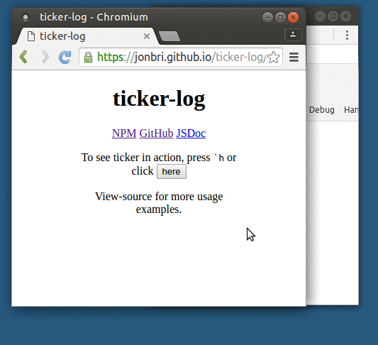

# ticker-log

[](https://travis-ci.org/jonbri/ticker-log)

On-screen logging utility.

Monkey-patches and chains the browser's `console` object.

Functionality is driven by `console` statements, `window._ticker`, and keyboard chords starting with `` ` `` (back-*tick*).

This module facilitates an *interactive-style* of development/non-production logging.



Play with ticker-log: http://jonbri.github.io/ticker-log/

## Example Usage
Load `node_modules/ticker-log/dist/ticker.min.js` and press `` ` ``-`t` to see a ticker log.

Press `` ` ``-`h` to show the quick-help reference.

In your source code, execute:
```js
console.log('`', 'hello ticker-log');
```

By default, `console`'s `log` function accepts ticker-log invocations (passing in the `` ` `` character as the first argument).

### Switch console "channel"
Rather than `log` you could listen to the `warn` channel.

Press `` ` ``-`<tab>` a few times until you see "listening to warn..." and now only invocations of ``console.warn('`', '...')`` will be printed.

To show *all* output to the current channel press `` ` ``-`b`, and to show all output from all channels use `window._ticker.listenToEverything()`.

### Execute ad-hoc testing code with keyboard "macros"
*watch* a variable:

```js
var a = 0;
setInterval(function() {
    console.log('`', a);
}, 500);
// do complicated things with "a"...
```

Usage of ticker-log is best suited for one-off, quick debugging situations, with any api code remnants removed before pushing to production.

## Motivation
Displaying on-screen logging output reduces browser debugger juggling (dev-tools, Firebug, etc) while you exercise your application.

It can also be valuable to target a specific sub-set of logs both statically (in your code) as well as at run-time using keyboard chords.

Typical use-cases:
* a better approach to "throw an `alert` in there"
* developing on non-desktop devices (difficult to access console)
* debugging timing issues that involve user interaction
* "special-event" emitting (listening and firing)

## Features
* Configurable via API and URL parameters
* Swap log view with textarea for easy copy/pasting
* Lightweight, no dependencies
* Macro system for run-time, on-demand, static function execution
* Regex log filtering

## Installation
```shell
npm install ticker-log
```

Load script: `node_modules/ticker-log/dist/ticker.min.js`

## Interface
To write to Ticker's "ticker tape" simply pass in a back-tick (`` ` ``) as a first argument to `console`'s logging functions (`log`, `fatal`, etc...).

For example:
```js
console.log('`', 'lorum ipsum...');
console.fatal('`', 'something very bad just happened...');
```

All actions can be driven by keyboard shortcut chords. Every key-combination starts with the back-tick key (`` ` ``).

### On-screen
Increase and decrease the speed of the ticker with `` ` ``-`<up>` and `` ` ``-`<down>`.

Move the horizontal position of the logs with `` ` ``-`<left>` and `` ` ``-`<right>`.

Change the vertical starting position with `` ` ``-`<pageUp>` and `` ` ``-`<pageDown>`.

Pause movement with `` ` ``-`p` (or on-click) and remove all with `` ` ``-`k`.

Show the current ticker log in a textarea (useful for copy/pasting) with `` ` ``-`o`. Show _all_ the accrued log output with `` ` ``-`l`.

Embed the current configuration settings in the browser-window's url with `` ` ``-`<enter>`.

For the full list of actions, show the help screen with `` ` ``-`h`.

### Configuration
A configuration object is maintained, of which most properties (if they differ from their default) can be expressed as a JSON object url parameter.

Property examples:
* speed logs travel up the screen (`interval`)
* starting position of logs (`logStartTop`)
* flush to left or right of screen (`align`)
* `console` channel to listen to (`channel`)

Configuration settings take this format when embedded as a url parameter:
```
http://localhost/index.html?_ticker={"interval":275,"channel":"debug"}
```

### API
Most on-screen actions can be scripted by using the global `_ticker` object:
```
window._ticker.help();          # show help screen
window._ticker.increaseSpeed(); # increase speed
window._ticker.decreaseSpeed(); # decrease speed
window._ticker.moveUp();        # make starting position a little higher
window._ticker.moveDown();      # make starting position a little lower
window._ticker.moveLeft();      # move logs to the left of the screen (the default)
window._ticker.moveRight();     # move logs to the right of the screen
window._ticker.pause();         # pause ticker log movement
window._ticker.kill();          # remove all ticker logs from screen
window._ticker.dump();          # show all configuration
```

Additional API is covered in the following sections.

### Channels
*Channels* allow you to control which logs are printed to the screen:
* log (default)
* debug
* warn
* error
* trace

By default, within the current channel, `console` invocations that are given `` ` `` as the first argument are printed.

To print all calls to the current channel set the `requireBacktick` configuration property to `false` (`` ` ``-`b`).

To show *all* `console` logging (regardless of channel) using the `listenToEverything` api function.

### Macros
Macros are bits of code you want to run at ad-hoc times. There are 10 "slots" stored in keys 0-9.

Macros 0-8 are reserved for api-driven macros:

```js
var variableToTrack;
window._ticker.registerMacro(0, function() {
    // output values of variables in closure scope
    console.log('`', 'variableToTrack: ' + variableToTrack);
});
// code exercises "variableToTrack"...
// invoke macro by pressing `-0
```

Macro 9 is reserved for an on-screen editing option. Press `` ` ``-`m` and a textarea will appear. Enter JavaScript code to be `eval`ed and press `` ` ``-`m` again to "register" the macro.

### Filtering
Filter all log output by *string*:
```js
window._ticker.filter('string subset match');
```

*regex*:
```js
window._ticker.filter(/^startsWith/);
```

*function*:
```js
window._ticker.filter(function(s) {
    // do something with log text
});
```

Pair filtering with `listenToEverything` to broadly filter:
```js
window._ticker.listenToEverything();
window._ticker.filter(someErrorCode);
```

### Custom action key
Use a custom key rather than the default `` ` `` key for keyboard chords:
```js
// additionally use the 'z' key as a modifier
window._ticker.config({
    defaultBacktickKeys: [192, 90] // `, Z
});
```

## Global-state Impact
* `window.history.pushState` and `window.location.replace`
  * "save" action (`` ` ``-`<enter>`)
* `window._ticker`
  * api namespace
* `console` functions (`log`, `debug`, etc)
  * `console` overrides are reverted when applicable (such as when changing channels)

Reset to default state:
```js
window._ticker.reset();
```

## Build
```shell
npm install
npm test        # run test suite (qunit, phantomjs)
npm run lint    # eslint
npm run serve   # http://localhost:9000/index.html
npm run package # build and populate dist
```

## License
[BSD-2-Clause](http://spdx.org/licenses/BSD-2-Clause)
